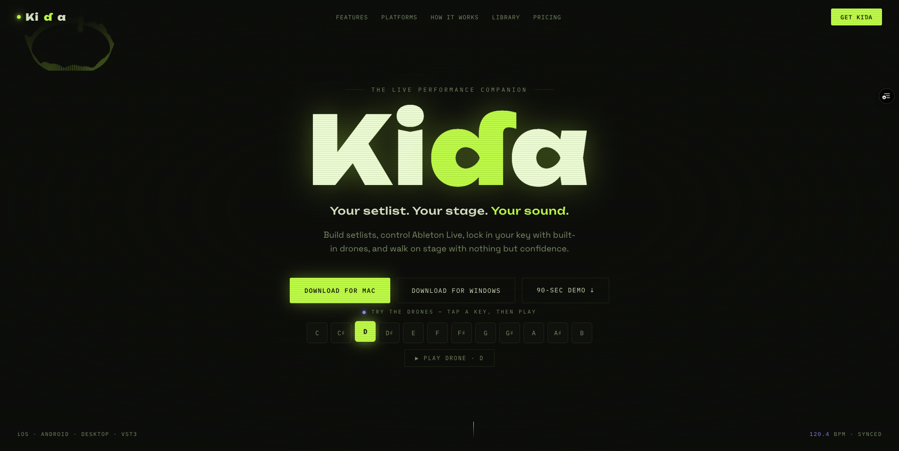
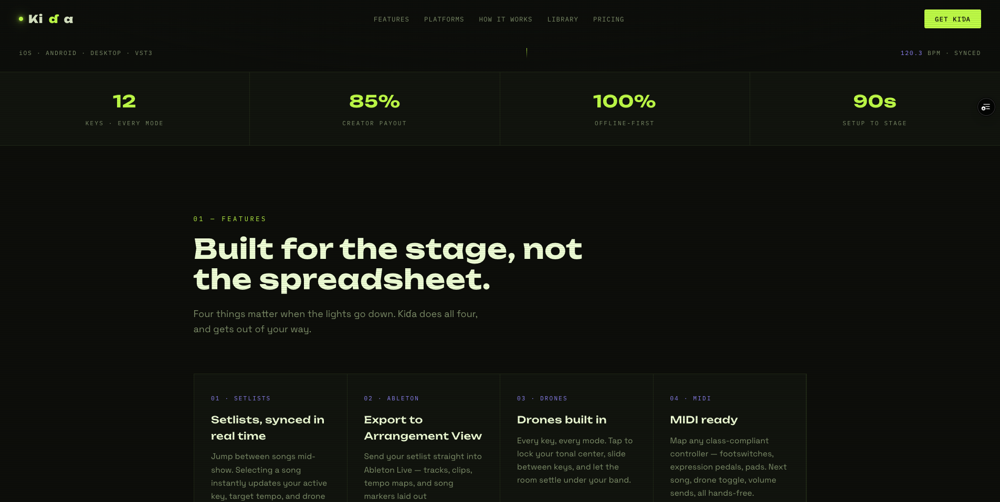
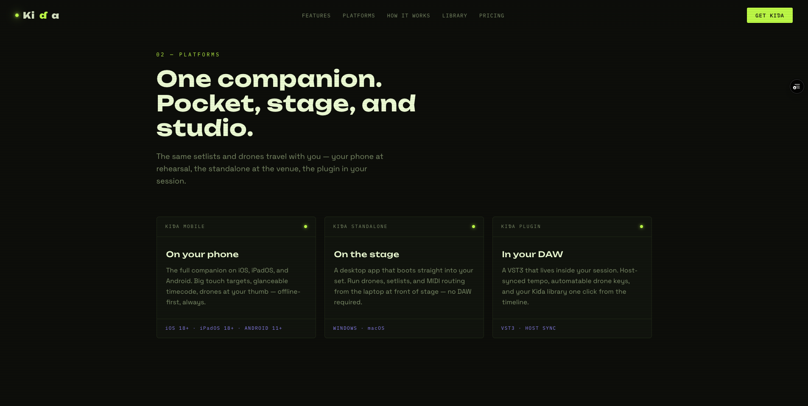
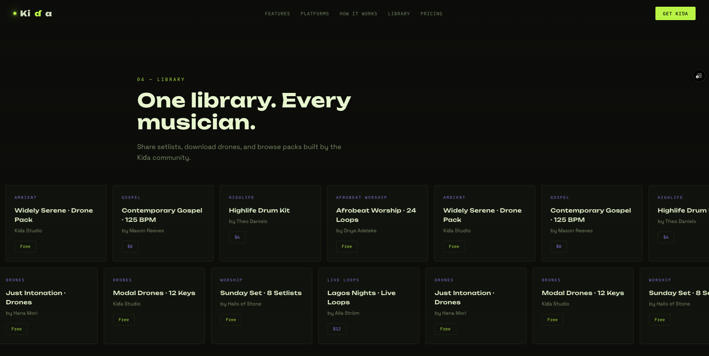
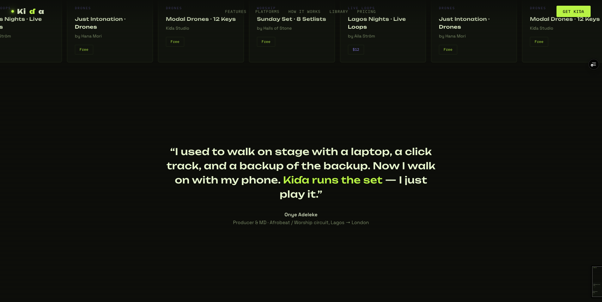
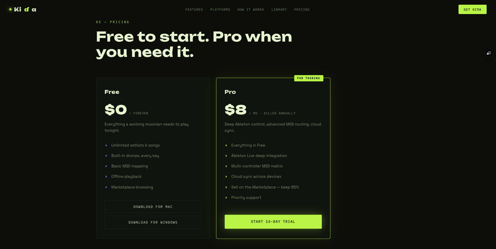
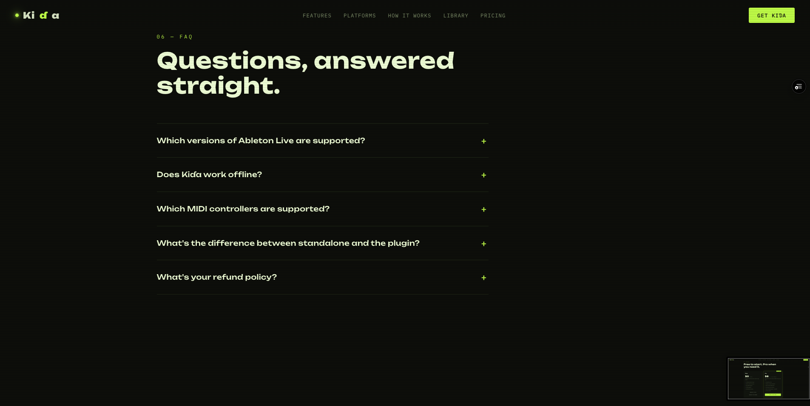
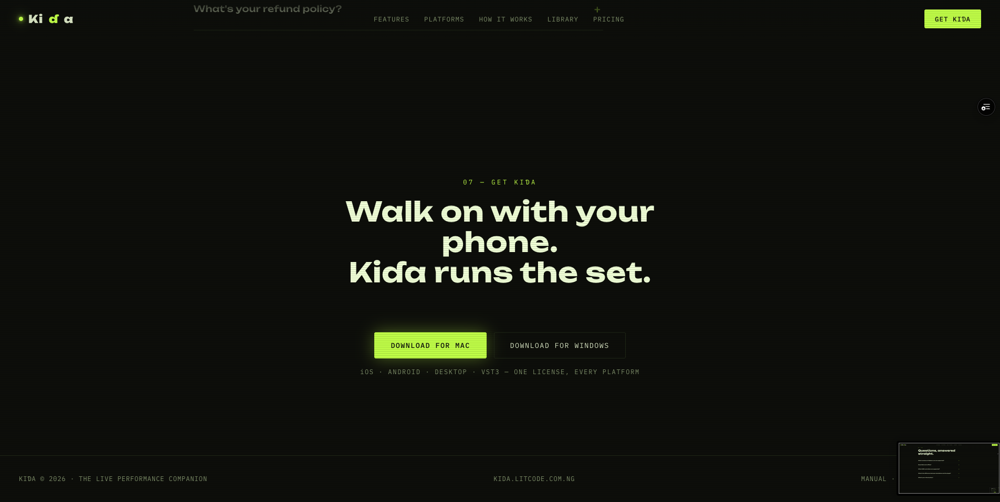

# Kiɗa — Marketing Website

The marketing and landing site for **Kiɗa**, the live-performance companion for working musicians — setlists, Ableton Live control, built-in drones, and MIDI, across mobile, desktop, and as a plugin.

Built with the Next.js App Router, React 19, Tailwind CSS v4, GSAP scroll animations, and a Three.js canvas backdrop.

## Screenshots

| | |
| --- | --- |
|  |  |
| Hero — "Your setlist. Your stage. Your sound." | Features — built for the stage, not the spreadsheet |
|  |  |
| Platforms — phone, standalone, and plugin | Library — drones, setlists, and packs |
|  |  |
| Testimonial | Pricing — Free and Pro |
|  |  |
| FAQ | Get Kiɗa — closing download CTA |

## Tech Stack

- **Framework:** [Next.js](https://nextjs.org) 16 (App Router)
- **UI:** React 19
- **Styling:** Tailwind CSS v4 (via `@tailwindcss/postcss`)
- **Animation:** [GSAP](https://gsap.com) + ScrollTrigger
- **3D / canvas:** [Three.js](https://threejs.org)
- **Language:** TypeScript
- **Package manager:** pnpm

## Getting Started

Install dependencies and run the development server:

```bash
pnpm install
pnpm dev
```

Open [http://localhost:3000](http://localhost:3000) to view the site.

### Scripts

| Command      | Description                       |
| ------------ | --------------------------------- |
| `pnpm dev`   | Start the development server      |
| `pnpm build` | Build the production bundle       |
| `pnpm start` | Serve the production build        |
| `pnpm lint`  | Run ESLint                        |

## Environment Variables

The site captures emails (app download requests and newsletter signups) and forwards them to a separate backend API.

| Variable                   | Description                                                                                  |
| -------------------------- | -------------------------------------------------------------------------------------------- |
| `NEXT_PUBLIC_API_BASE_URL` | Base URL of the backend API. Defaults to an empty string (same origin) when unset.          |

Backend endpoints consumed:

- `POST /api/v1/app/download-request` — desktop (Mac/Windows) download via email
- `POST /api/v1/newsletter/subscribe` — newsletter signup

## Project Structure

```
app/
  layout.tsx                 Root layout + site metadata
  page.tsx                   Home route (renders KidaLanding)
  globals.css                Global styles + design system
  privacy/page.tsx           Privacy policy
  terms/page.tsx             Terms of service
  components/
    KidaLanding.tsx          Home landing page (the live page)
    DownloadModal*.tsx        Email-capture download modal + provider
    Navbar.tsx, Footer.tsx   Shared chrome for the legal pages
    TableOfContents.tsx      Sticky "on this page" nav (legal pages)
    RevealOnScroll.tsx       Scroll-reveal animation helper
    NewsletterForm.tsx       Newsletter signup form
    Hero, Pricing, FAQ, ...  Legacy section components (see note)
public/                      Static assets and images
```

> **Note:** The home page (`/`) is a single self-contained component, `app/components/KidaLanding.tsx`, rendered by `app/page.tsx`. The `/terms` and `/privacy` pages instead compose the shared `Navbar`, `Footer`, `NewsletterForm`, `TableOfContents`, and `RevealOnScroll` components, styled by the `legal-*` and shared classes in `globals.css`. The remaining section components (`Hero`, `Pricing`, `Bento`, `FAQ`, …) and `page copy.tsx` are an earlier, unused variant of the landing page.

## Deployment

Deploy on [Vercel](https://vercel.com/new). Set `NEXT_PUBLIC_API_BASE_URL` in the project's environment variables so the email-capture forms reach the backend.
